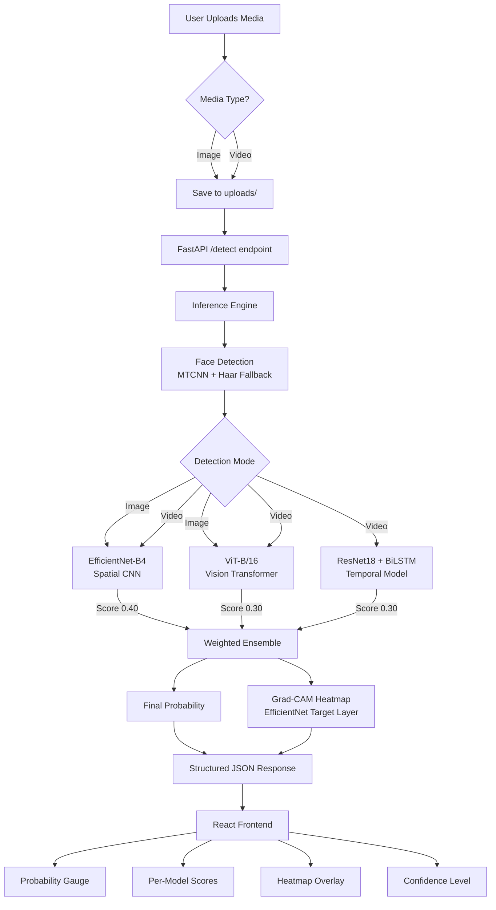
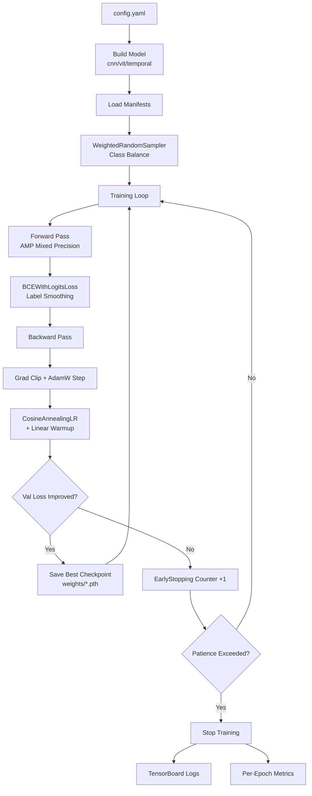

# Architecture — Anti-Gravity Deepfake Detection System

## System Architecture Diagram

---

## Data Pipeline

```mermaid
graph LR
    A[Raw Datasets] --> B[download_scripts/]
    B --> C[Video Files]
    C --> D[Frame Extraction\nOpenCV @ 1 FPS]
    D --> E[Face Detection\nMTCNN]
    E --> F[Face Alignment\n5-Point Landmarks]
    F --> G[Resize 224x224]
    G --> H[PNG Face Images]
    H --> I[CSV Manifest\ntrain/val/test]
    I --> J[DeepfakeDataset\nPyTorch]
    J --> K[Augmentation\nAlbumentations]
    K --> L[Training Loop]
```

---

## Model Training Pipeline

---

## Component Responsibilities

| Component | File | Responsibility |
|-----------|------|---------------|
| CNN Model | `models/cnn_model.py` | Spatial artifact detection via EfficientNet-B4 |
| ViT Model | `models/vit_model.py` | Global inconsistency detection via attention |
| Temporal Model | `models/temporal_model.py` | Time-domain anomaly detection via BiLSTM |
| Ensemble | `models/ensemble_model.py` | Weighted combination of all three models |
| Face Detector | `utils/face_detection.py` | MTCNN face detection + alignment |
| Augmentation | `utils/augmentation.py` | Albumentations training / val transforms |
| Grad-CAM | `utils/gradcam.py` | Explainability heatmap generation |
| Video Utils | `utils/video_utils.py` | Frame extraction from video files |
| Preprocessor | `datasets/preprocessing/preprocess.py` | Raw video → processed face images |
| Training | `training/train.py` | Full training loop with GPU, AMP, early stopping |
| Metrics | `evaluation/metrics.py` | ROC-AUC, F1, ablation study |
| API | `api/app.py` | FastAPI endpoints |
| Inference Engine | `api/inference.py` | Production inference with face detection + heatmap |
| Frontend | `frontend/react-ui/` | React + Vite + TailwindCSS UI |
